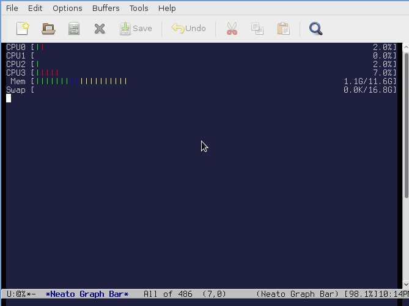

neato-graph-bar.el - htop-like CPU and memory graphs for Emacs
--------

A new mode that provides htop-like graphs for CPU and memory consumption. A good
companion for proced.

Usage
--------
Run with `M-x neato-graph-bar` after (require)ing `'neato-graph-bar`. This
requires neato-graph-bar.el to be on your load path.

Configuration options are under 'Applications' -> 'Neato Graph Bar' in
`M-x customize`.

Known Bugs
--------
* Requires Linux's /proc/meminfo and /proc/stat right now, so may not be
portable to other Unixes
* Graph layouting is very weak - can only specify full-width bars sequentially
* No way to configure which graphs to show or hide
